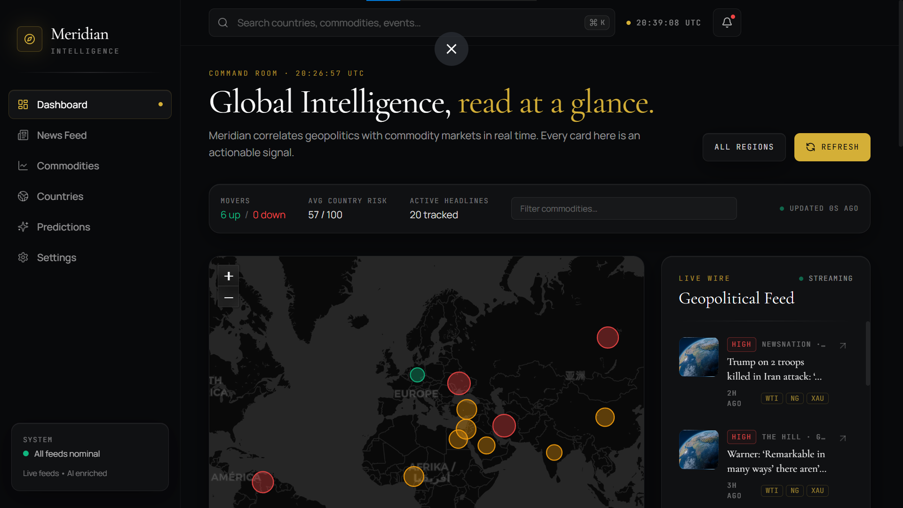
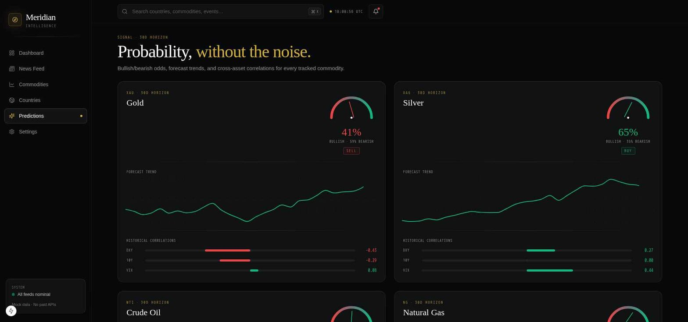
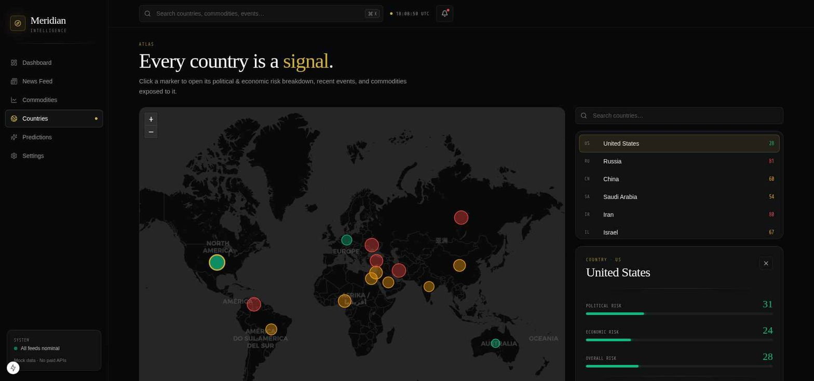

# Meridian Intelligence

**AI-powered geopolitical market intelligence dashboard.** Meridian tracks live commodity prices, live global news, and connects the two with AI — answering not just *"what is the market doing?"* but *"why is it moving?"*

🔗 **Live site:** https://meridian-intelligence-sandy.vercel.app





---

## What it does

- **Live commodity prices** — gold, silver, crude oil, natural gas, wheat, corn — pulled from Yahoo Finance, with historical sparklines and multi-timeframe charts (1D / 7D / 30D / 1Y).
- **Live geopolitical news** — pulled from Google News RSS across energy, trade, sanctions, and macro queries, deduplicated and cached.
- **AI enrichment** — every headline is run through Llama 3.3 70B (via Groq) to extract event type, affected countries, affected commodities, market sentiment, and a geopolitical risk score.
- **AI-generated market insights** — a dashboard panel that reads current news + prices and writes plain-English analysis connecting the two.
- **AI prediction engine** — per-commodity directional calls (Up / Down / Neutral) with confidence, time horizon, and written reasoning, grounded in live price action and related news.
- **World risk map** — interactive country-level geopolitical risk atlas.
- **Full commodity explorer** — list + detail pages with geopolitical exposure and related headlines per asset.

Every AI and data feature has a graceful fallback — if an API key is missing or a live source is unreachable, the app falls back to a curated mock dataset instead of crashing or showing a blank page.

---

## Tech stack

**Frontend**
- Next.js 15 (App Router) + React 19 + TypeScript
- Tailwind CSS, Framer Motion, Recharts, React-Leaflet

**Backend**
- FastAPI (Python), organized into `routes/`, `services/`, `schemas/`
- SQLite for settings persistence

**Data & AI — all free tier, no paid APIs**
- [Yahoo Finance](https://finance.yahoo.com) via `yfinance` — commodity prices
- [Google News RSS](https://news.google.com) via `feedparser` — live headlines
- [Groq](https://groq.com) (`llama-3.3-70b-versatile`) — AI insights, news enrichment, predictions

**Deployment**
- Backend → [Render](https://render.com) (free web service)
- Frontend → [Vercel](https://vercel.com) (free tier)

---

## Architecture

```
Browser
  │
  ▼
Next.js (Vercel)
  │  fetch()
  ▼
FastAPI (Render)
  │
  ├── services/price_service.py      → Yahoo Finance, cached 5 min
  ├── services/news_service.py       → Google News RSS + Groq enrichment, cached 10 min
  ├── services/ai_service.py         → Groq-generated dashboard insights
  ├── services/prediction_service.py → Groq-generated per-commodity predictions, cached 5 min
  └── database.py                    → SQLite (settings persistence)
```

All external calls (Yahoo, Google News, Groq) are wrapped with try/except and fall back to mock data on failure — the app never shows an error page to the user due to a third-party outage.

---

## Running locally

**Backend**
```bash
cd backend
python -m venv venv
venv\Scripts\Activate.ps1        # Windows
# source venv/bin/activate       # Mac/Linux
pip install -r requirements.txt
```

Create `backend/.env`:
```
GROQ_API_KEY=your_key_here       # optional — app falls back to mock data without it
CORS_ORIGINS=http://localhost:3000
```

```bash
uvicorn main:app --host 0.0.0.0 --port 8001 --reload
```

**Frontend**
```bash
cd frontend
yarn install
```

Create `frontend/.env.local`:
```
NEXT_PUBLIC_BACKEND_URL=http://127.0.0.1:8001
```

```bash
yarn dev
```

Visit `http://localhost:3000`.

---

## API endpoints

| Method | Route | Description |
|---|---|---|
| GET | `/api/dashboard` | Combined snapshot: commodities, news, countries, AI insights |
| GET | `/api/commodities` | All tracked commodities, live prices |
| GET | `/api/commodities/{symbol}` | Single commodity detail + history + exposure |
| GET | `/api/news` | Live, AI-enriched news feed |
| GET | `/api/countries` | Country-level geopolitical risk |
| GET | `/api/countries/{code}` | Single country detail |
| GET | `/api/predictions` | AI-generated per-commodity predictions |
| GET | `/api/settings` | User settings (persisted) |
| PUT | `/api/settings` | Update settings |

Interactive docs available at `/docs` (Swagger UI).

---

## Project status

Built in milestones, from environment setup through live deployment:

- ✅ Environment setup & tooling
- ✅ Commodity explorer + detail pages
- ✅ Engineering foundation (config, logging, error handling, linting)
- ✅ Backend refactor (`routes/` / `services/` / `schemas/`)
- ✅ Live commodity prices (Yahoo Finance)
- ✅ Live news + AI enrichment (Groq)
- ✅ AI prediction engine + dashboard polish
- ✅ Deployed live (Render + Vercel)

---

## Disclaimer

This is a portfolio / educational project. Predictions and AI-generated insights are illustrative and **not financial advice**. Data is sourced from free-tier APIs and may be delayed or rate-limited.